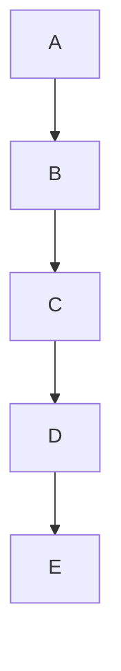

# git 디펜던시가 많을 때 rebase 팁

브랜치 의존성이 A → B → C → D → E 처럼 연쇄적으로 존재할 때, A의 PR 과정에서 수정사항이 발생하면 B 이하의 브랜치들에서 충돌이 발생할 수 있습니다. 이런 상황에서 효과적으로 충돌을 해결하는 rebase 전략을 설명합니다.

```mermaid
flowchart
    A --> B --> C --> D --> E

```
