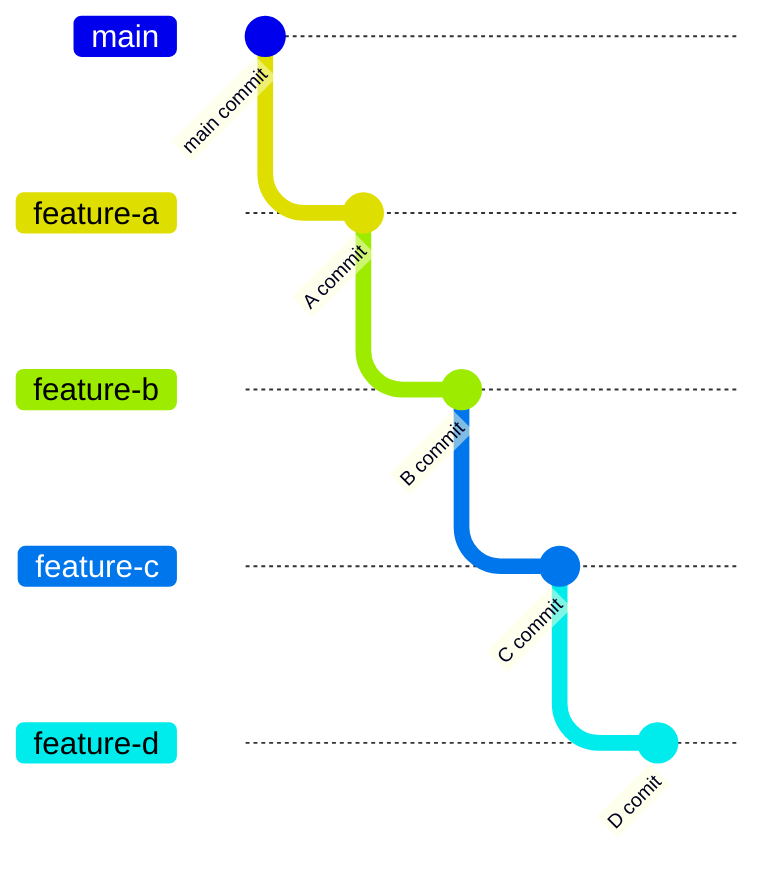
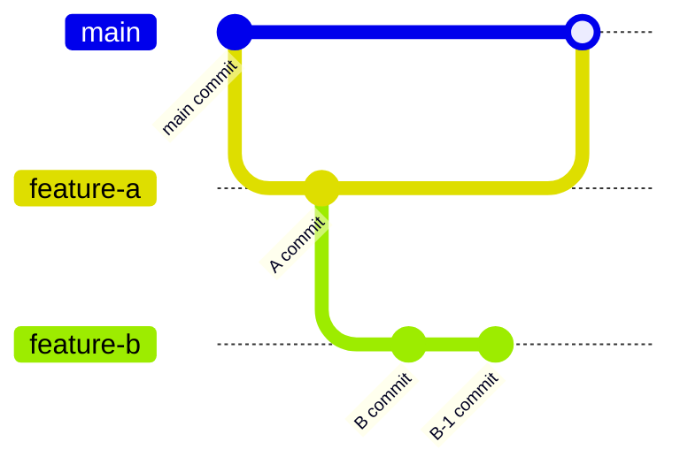
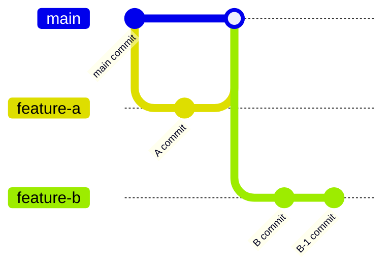

# pr 간 디펜던시가 많을 때 rebase 효과적으로 하는 방법

아래와 같이 브랜치 간 의존성이 연쇄적으로 존재할 때(A → B → C → D), 상위 브랜치의 PR이 수정사항과 함께 머지되면 하위 브랜치들에서 rebase 시 충돌이 발생할 수 있다. 이런 상황에서 효과적으로 rebase하는 방법을 알아본다.  
[👉 rebase가 동작하는 원리](/notes/git-how-rebase-works/)



### 문제 상황

1. **[feature-a → main]** feature-a 브랜치가 리뷰 후 수정사항과 함께 main에 머지됨 (아래와 같은 상태)



2. **[feature-b → main]** feature-b 브랜치 PR을 오픈하기 위해 main을 rebase 해야됨
3. **[feature-b → main]** feature-b는 feature-a에서 파생된 브랜치여서 main에 rebase시 feature-a의 변경사항도 같이 적용하게 된다.
   - `A commit`, `B commit`, `B-1 commit`
4. **[feature-b → main]** feature-a의 리뷰중 수정사항이 main에 반영되었기 때문에 `A commit`를 반영하는 과정에서 충돌이 일어날 확률이 높다.

### 해결 방법: rebase --onto 활용

--onto 옵션을 사용해 특정 커밋 범위만 rebase할 수 있다

```sh
git rebase --onto <새로운_기준점> <시작_커밋> <종료_커밋>
# <시작_커밋> ~ <종료_커밋> 의 커밋들만 rebase 된다
```

즉, rebase 과정에서 feature-b에서의 변경사항만 main에 적용하려면

```sh
git checkout feature-b
git rebase --onto main feature-a feature-b
```

이렇게 적용하면

> feature-a 이후부터 feature-b까지의 커밋만 main 위에 재배치하라

라는 의미이다. 이를 통해 이미 main에 병합된 feature-a의 변경사항이 중복 적용되는 것을 방지할 수 있고, feature-a에서 수정사항이 있어도 feature-b 브랜치의 변경사항만 적용되기 때문에 충돌이 일어날 가능성을 줄일 수 있다.

즉, 앞에 3번 과정이 아래와 같이 적용된다

3. **[feature-b → main]** feature-b는 feature-a 이후 feature-b까지의 변경사항만 rebase에 적용한다.
   - `B commit`, `B-1 commit`

최종 그림은 다음과 같다.



### 다른 브랜치에도 활용

동일한 방식으로 나머지 브랜치들도 rebase 할 수 있다

```sh
# feature-b가 머지된 후
git checkout feature-c
git rebase --onto main feature-b feature-c

# feature-c가 머지된 후
git checkout feature-d
git rebase --onto main feature-c feature-d
```
